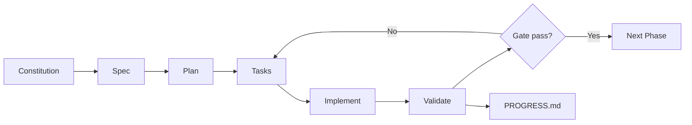

# Spec-Driven Development (SDD) Workflow

> This project follows **SDD** — specifications drive implementation, optimized for expert AI agents.

---

## Artifact Chain

```
Constitution → Spec → Plan → Tasks → Implement → Validate → Progress
     ↓            ↓      ↓       ↓         ↓          ↓         ↓
constitution   spec   plan   PHASE-*.md   code      gates   PROGRESS.md
```

| Step | Artifact | Purpose | Who edits |
|------|----------|---------|-----------|
| **0. Constitution** | [constitution.md](./constitution.md) | Guardrails, standards, quality gates | Human (rare) |
| **1. Specify** | [spec.md](./spec.md) | What & why — requirements, user stories | Human + AI clarify |
| **2. Plan** | [plan.md](./plan.md) | How — architecture, design system, structure | Human + AI |
| **3. Tasks** | [tasks/PHASE-*.md](../../tasks/) | Atomic work units with acceptance criteria | AI executes, human reviews |
| **4. Implement** | `src/` code | Generated from tasks | AI agent |
| **5. Validate** | Phase gates in task files | Verify output matches spec | Human + AI |
| **6. Progress** | [PROGRESS.md](../../PROGRESS.md) | Dashboard — done/total per phase | AI updates daily |

---

## SDD Lifecycle



---

## For AI Agents

Read [AGENTS.md](../../AGENTS.md) for the full execution playbook.

**Quick start per session:**

```
1. Read constitution.md  (guardrails)
2. Read spec.md section    (relevant requirements)
3. Read plan.md section    (relevant design/architecture)
4. Open tasks/PHASE-N.md   (find next unchecked task)
5. Implement task          (match AC exactly)
6. Validate                  (run checks in task)
7. Check off + update PROGRESS.md
```

---

## Traceability

Every task references spec and plan sections:

| Task prefix | Spec section | Plan section | Weeks |
|-------------|--------------|--------------|-------|
| P1-* | Homepage, About, Contact, CMS | §2 Design System, §3 Components, §7 Architecture | W1–W4 |
| P2-* | Services, Solutions, Portfolio, Blog | §4 Page Designs, §7.2 CMS Models | W5–W8 |
| P3-* | Animations, SEO, Accessibility | §5 Animations, §9–10 SEO/A11y | W9–W10 |
| P4-* | AI Features | §8 AI Features UX, §7 Architecture | W11–W14 |
| P5-* | Infrastructure, AWS | §7 Architecture, §7.3 Docker | W15–W18 |

---

## When Requirements Change

1. Edit `spec.md` first (the what)
2. Update `plan.md` if architecture/design changes (the how)
3. Add/adjust tasks in `tasks/PHASE-*.md`
4. Update `PROGRESS.md` totals if task count changes
5. Implement + validate

**Never change code without updating the spec chain.**

---

## File Map

```
docs/sdd/
├── README.md          ← You are here
├── constitution.md    ← Guardrails (step 0)
├── spec.md            ← Requirements (step 1)
└── plan.md            ← Design + architecture (step 2)

tasks/
├── README.md          ← Task format guide
├── PHASE-1.md         ← Implementation tasks (step 3)
├── PHASE-2.md
├── PHASE-3.md
├── PHASE-4.md
└── PHASE-5.md

AGENTS.md              ← AI agent playbook
PROGRESS.md            ← Progress dashboard (step 6)
```

---

*SDD methodology: Specify → Plan → Tasks → Implement → Validate*
